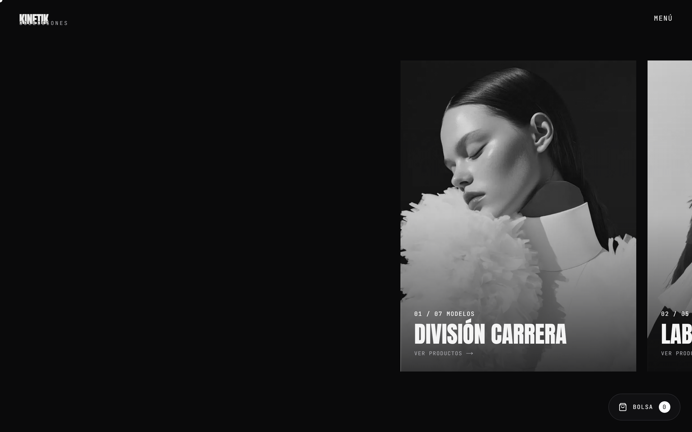
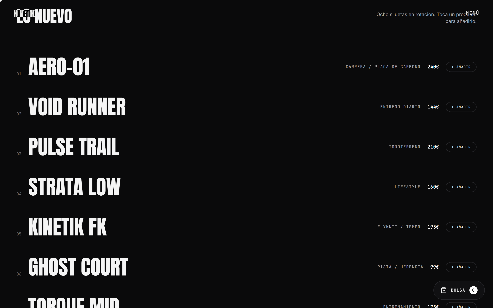
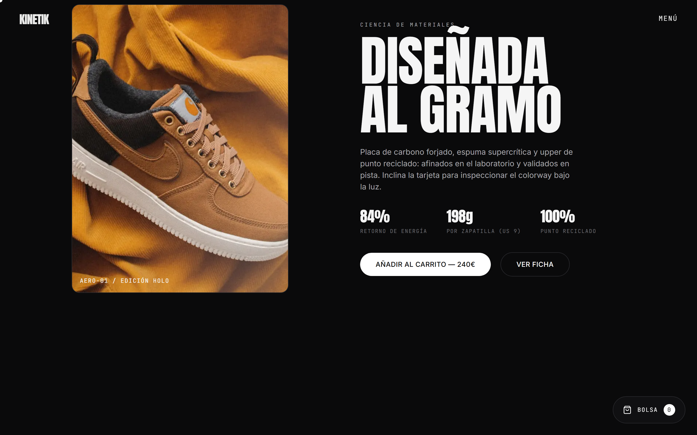
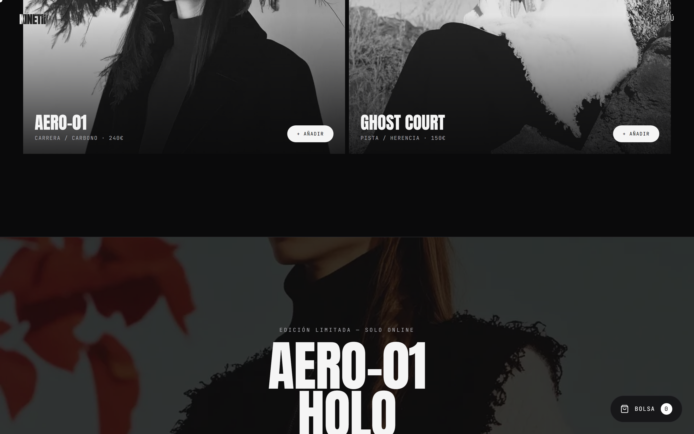
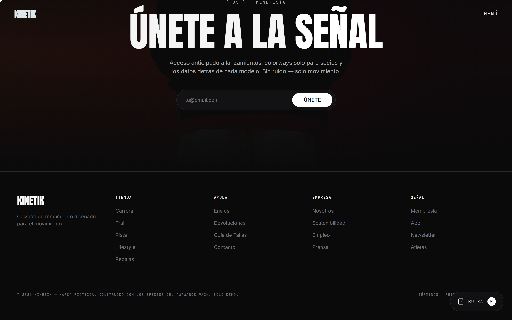

# KINETIK — Engineered Motion

**🔗 Live:** https://kinetik-beryl.vercel.app/

Experiencia web premium de una sola página para **KINETIK**, una marca ficticia de calzado de rendimiento. Homepage de scroll largo con hero 3D, navegación fullscreen, transiciones cinematográficas y una secuencia de secciones de producto animadas por scroll.


## Stack

- **Next.js 15** (App Router) · **React 19** · **TypeScript**
- **Tailwind CSS** — sistema mono/stealth (tinta `#0B0B0C`, nube `#F5F5F5`, blanco puro como único acento; el rojo rebaja `#FF3B30` es el único color semántico)
- **GSAP + ScrollTrigger** · **Lenis** smooth scroll · **Three.js** (WebGL)

## Ejecutar

```bash
npm install
npm run dev      # http://localhost:3000
npm run build && npm start
```

## Secciones y efectos

Cada sección es un componente React cliente con su lógica Three.js / GSAP encapsulada en `useEffect` con limpieza completa.

| Componente | Efecto |
|---|---|
| `sections/Hero.tsx` | Hero 3D con pin de scroll — la zapatilla (GLB) rota al hacer scroll, revelado con máscara circular y tooltips de características |
| `visual/DitherBackground.tsx` | Fondo global WebGL de ondas con dithering, reactivo al puntero |
| `sections/Navigation.tsx` | Menú fullscreen — la página rota al abrirse, barrido con clip-path e imagen de preview al hacer hover en cada link |
| `providers/PageTransition.tsx` | Panel de cobertura en la intro + wipe entre destinos de la misma página |
| `sections/Collections.tsx` | Escaparate horizontal con pin y parallax de imágenes |
| `sections/Featured.tsx` | Lista de productos con hover-reveal — wipes direccionales de clip-path sobre la imagen |
| `providers/Cart.tsx` | Micro-animación fly-to-bag al añadir al carrito |
| `sections/Categories.tsx` | Formación de layout al hacer scroll — las piezas vuelan hasta componer la cuadrícula |
| `sections/Showcase.tsx` | Tarjeta de producto holográfica que se inclina con el ratón + texto cinético iluminado por scroll |
| `sections/Marquee.tsx` | Separadores marquee sensibles a la velocidad del scroll |

## Capturas

| | |
|---|---|
|  |  |
|  |  |
|  |  |



## Assets

- `public/models/sneaker.glb` — modelo de zapatilla CC0 (Khronos / Shopify *MaterialsVariantsShoe*).
- `public/img/sneakers/*` — fotografía de producto (Unsplash).
- `public/img/editorial/*` — imágenes editoriales de campaña.

## Notas de rendimiento

- Todo el WebGL (hero + fondo dither) se carga con `dynamic(..., { ssr:false })` y de forma perezosa.
- Un único ticker compartido de Lenis + GSAP; los pins de ScrollTrigger usan `refreshPriority` para que las tres secciones con pin (hero, colecciones, categorías) se recalculen en orden de documento.
- `prefers-reduced-motion` desactiva el smooth scroll y la animación de fondo, y acorta el pin del hero.

## Autor

**Marcos Pérez Esteban**
